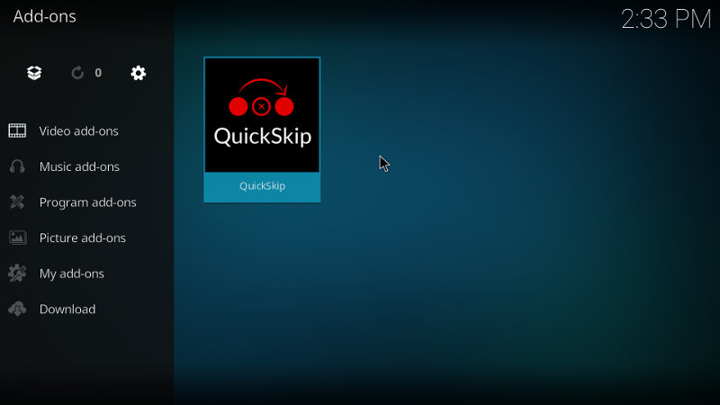
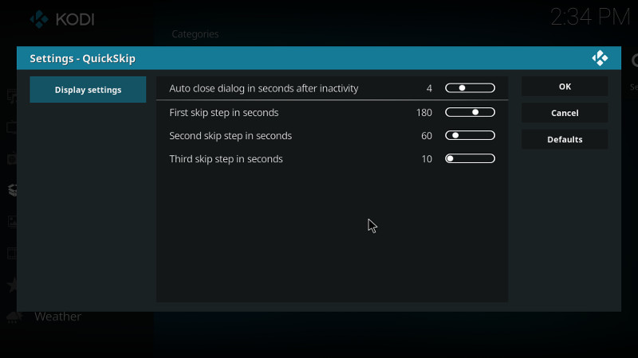
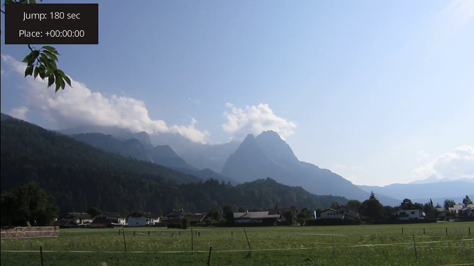

# QuickSkip for Kodi 

## Introduction

This add-on for Kodi (former XBMC) allows you to fast skip commercials in TV show recordings with a few button presses. The main idea is to skip the recording forward in 180 or 60 second steps as long as you see that the TV show is running again. After that, you can skip backward or forward to find the exact position where the commercials end and the TV show continues. All you need to do is to press the `up` key during video playback and then press `right` or `left` keys to find the position where the commercials end. Similar functionality was provided in Topfield PVR set-top boxes as an TAP add-on named [Skip It](http://www.saunalahti.fi/tsalomak/skipit.html).

Typical usage scenario is this:
1. You are playing a recorded TV show and commercials are starting. You want to skip to place where the commercials have ended and the TV show continues.
1. Press `up` key to show the add-on dialog.
1. Press `right` to skip 180 seconds forward.
1. You see that commercials are still running. Press `right` key again to skip 180 seconds forward.
1. You see that commercials are not running anymore so you skipped too far. Press `left` key to skip 180 / 2 = 90 seconds backwards.
1. You see that commercials are still not running so you have to skip a little bit more backwards. Press `left` key again to skip 90 / 2 = 45 seconds backwards.
1. You see that commercials are now running so you have to skip a little bit more forward. Press `right` key to skip 45 / 2 = 22 seconds forward.
1. You see that the commercial break is just ending and the TV show continues. Don't press anything and the add-on dialog will disappear in a few seconds.

Usage might sound complicated at first but it is very powerful, intuitive and fast way to skip commercials. You can skip commercials in just a few seconds by pressing `right` and `left` keys to the direction where the commercial break is ending and TV show continues.

## Supported Kodi versions

This add-on has been tested to work well at least in following setups:
* LibreELEC 9.0.1 with Kodi version 18.1
* LibreELEC 7.0.3 with Kodi version 16.1

## Installation to Kodi

1. Download this repository as [zip file](https://github.com/mvestola/plugin.video.quick.skip/archive/master.zip).
1. Copy the zip file to the computer you are running Kodi.
1. Install the plugin from the zip file using the Kodi add-on manager
1. Define the key that will launch the add-on. You have two options to do this:
   1. Use [Keymap editor add-on](http://kodi.wiki/view/Add-on:Keymap_Editor) to configure the key. Select `Programs...Keymap Editor...Edit...Fullscreen Video...Add-ons...Launch QuickSkip` and Input the `up` key. Finally save Keymap Editor settings.
   1. Create user defined keymap file to your computer running Kodi to location `~/.kodi/userdata/keymaps/quick-skip-keymap.xml` with contents same as in file [/resources/data/quick-skip-keymap.xml](/resources/data/quick-skip-keymap.xml). Reboot Kodi.

## Usage in Kodi

1. Open some video file and play it in fullscreen mode
1. Click `up` key from your keyboard or remote control: a dialog window should appear to the top left corner
1. Use `left` and `right` arrow keys from your keyboard or remote control to skip to direction you want
1. You can press `OK` key to change the time to skip from 180 sec -> 60 sec -> 10 sec.
1. Close the dialog with `Esc` from your keyboard or `back` from your remote control. Or just wait for a few seconds and the dialog will automatically close.

You can change some settings for the add-on in the add-on settings page in Kodi. Values that can be changed are:
* Time in seconds to auto close the dialog
* First, second and third skip values in seconds which default to 180 / 60 / 10 seconds. These are the skip seconds that change when you press the `OK` key when add-on dialog is visible.

## Screenshots

## Changelog

### 1.0.0 (2017-04-15)
* First stable release

## Contact

You can contact the developer by email: quick.skip@mvnet.fi

For reporting bugs, use the GitHub issue tracker.
